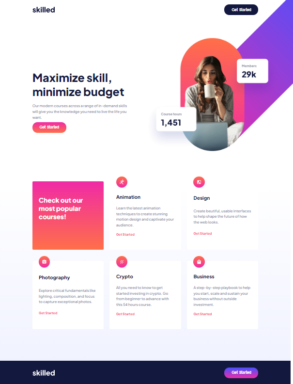
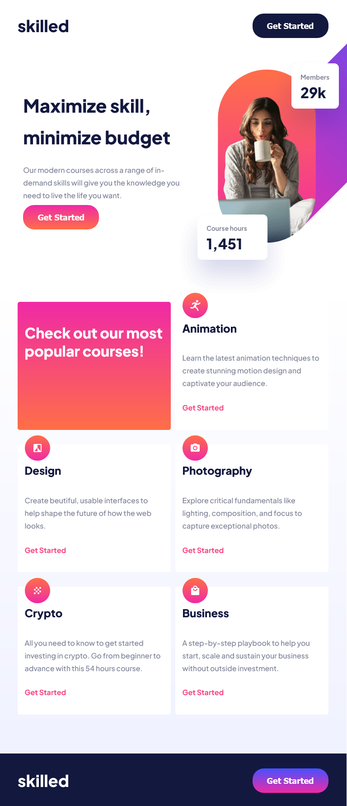

# e-Learning-Website
This is the project from Frontend Mentor to create an e-Learning Website with the given design
Frontend Mentor - Skilled e-learning landing page solution

This is a solution to the [Skilled e-learning landing page challenge on Frontend Mentor](https://www.frontendmentor.io/challenges/skilled-elearning-landing-page-S1ObDrZ8q). Frontend Mentor challenges help you improve your coding skills by building realistic projects.

## Table of contents

- Overview
  - The Challenge
  - Screenshot
  - Links
- My process
  - Built with
  - What I learned
- Author

## Overview

### The challenge

This is the challenge from Frontend Mentor to build a e-Learning Website
by using HTML & CSS. Our Challenge is to build the e-Learning
and get it looking as close to the design as possible. Besides, it should
be able to responsive (adapt to different size of device screen).

Users should be able to:

- View the optimal layout depending on their device's screen size
- See hover states for interactive elements

### Screenshot

Here are the preview of the product card that I've created.

On Desktop

On Tablet

On Mobile

### Links

- Solution URL: https://github.com/Biggboss7/e-Learning-Website
- Live Site URL: https://biggboss7.github.io/e-Learning-Website/

## My process

### Built with

- Semantic HTML5 markup
- CSS custom properties
- Flexbox
- - CSS Grid

### What I learned

During the process of building this project, I faced a lot of problems.
By searching through Google and Stackoverflow, I can finally accomplish
this project although I still realise my solution is not the best.

Below are some of the important things I learned/got from this project:
1. Enhance my skill to build better structure HTML and CSS properties
2. Deepen my knowledge about positioning
3. How to build responsive website on desktop, tablet, and mobile

## Author
- Github [Michael Tze] - https://github.com/Biggboss7
